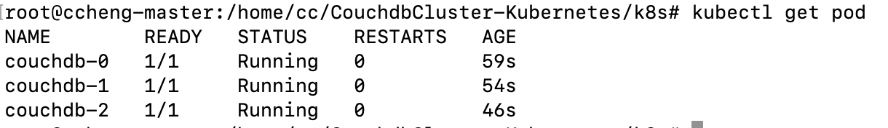
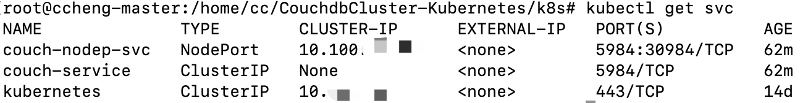
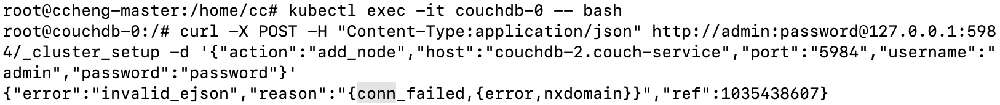

# CouchdbCluster-Kubernetes

Create a couchdb cluster with 3 nodes on Kubernets.

[Reference](https://faun.pub/deploying-a-couchdb-cluster-on-kubernetes-d4eb50a08b34)

## Steps to Replicate

- create a Kubernetes cluster

- on master node, create 3 directories: `couchdb-0`, `couchdb-1`, `couchdb-2`

- clone this repo, `cd k8s`

- run `kubectl create -f pv.yaml` to create persistent volumes

- run `kubectl create -f couchdb-stateful.yaml`to create the statefulset containing 3 workers

  - desired output: 

    

  - to delete statefulset: `kubectl delete statefulsets couchdb`

  - to debug pod/statefulset: `kubectl describe pod/statefulsets <name>`

- run `kubectl create -f services.yaml` to create IP service for inner connection and NodePort for external connection

  - desired output:

    

  - can access the fauxton interface remotely via [http://Kubernetes-worker-node-ip:30984/_utils](http://kubernetes-worker-node-ip:30984/_utils)

- ssh into each pod to join the couchdb cluster

## Problems

- (0412) after ssh-ing into each pod and trying to add node to the cluster, returns error msg as followed

